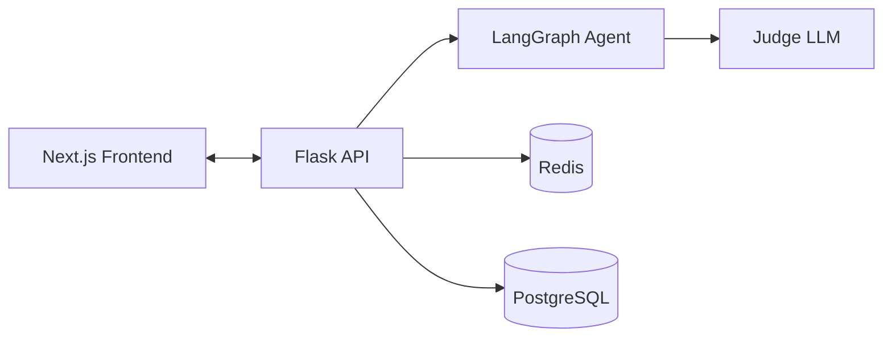
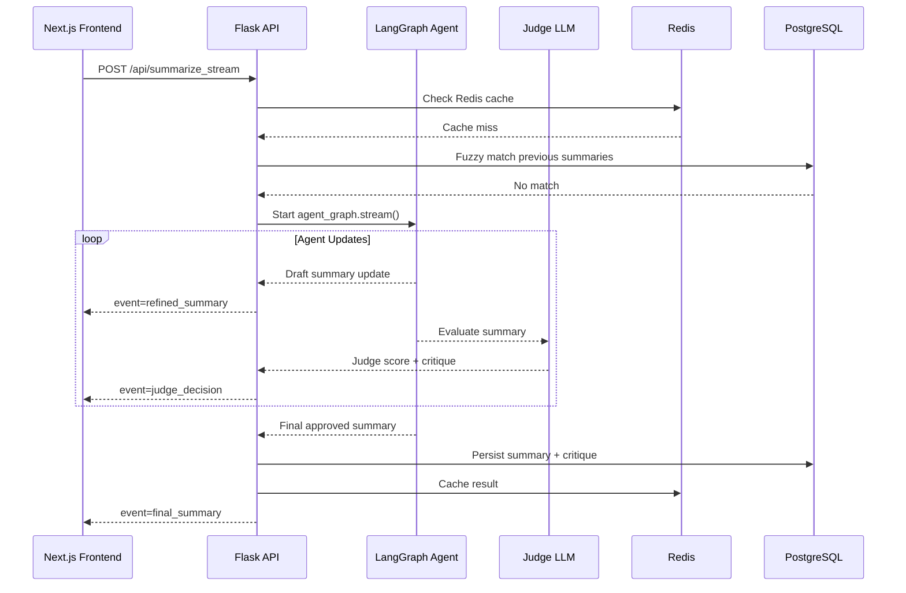
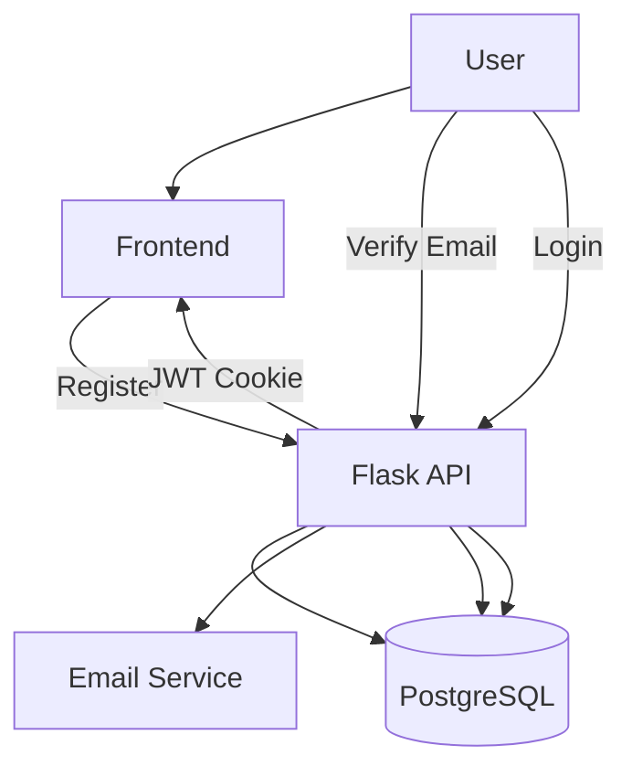

# Summarizer Backend

A production-ready Flask API that generates high-quality text summaries using an agentic self-correction loop, streaming responses, user authentication, and multi-layer caching. The system is designed to be reliable, cost-aware, and safe for multi-user deployment.

This backend powers a Next.js frontend that displays summaries in real time as they are refined and evaluated.

---

## Who This Is For

This service is designed for users who want fast, reliable summaries of long-form text (articles, blog posts, reports) with transparency into how the summary was produced. It supports authenticated multi-user usage and is optimized for low latency, controlled LLM cost, and real-time feedback.

---

## Overview

This service exposes REST and streaming endpoints for text summarization. Instead of returning a single LLM output, the system uses a LangGraph-based agent that iteratively refines summaries and evaluates them with an LLM-as-a-Judge before emitting a final result.

Summaries are streamed to the frontend incrementally using NDJSON, allowing users to observe drafts, critiques, and final approvals in real time.

The backend supports authenticated users, email verification, daily usage quotas, persistent history, and Redis-backed caching to minimize latency and LLM cost.

---

## Key Features

- Agentic self-correction loop using LangGraph
- Streaming summarization with incremental drafts and judge feedback
- LLM-as-a-Judge with structured Pydantic schemas
- JWT-based authentication with email verification
- Per-user daily quota enforcement
- Persistent summary history
- Redis + database-backed caching
- Production-ready Flask app with Gunicorn deployment

---

## Tech Stack

- Backend: Flask, Flask-Migrate, SQLAlchemy
- AI Orchestration: LangGraph, Pydantic
- Database: PostgreSQL
- Caching: Redis
- Auth: JWT (HTTP-only cookies)
- Streaming: NDJSON over HTTP
- Deployment: Gunicorn

---

## System Architecture



## Streaming Summarization Workflow



---

## User Authentication & Quotas

### Authentication Flow



## API Design

Endpoint Example

```
POST /api/summarize-stream
Content-Type: application/json
```

Request

```json
{
  "text": "Input text to be summarize"
}
```

Streaming Response (NDJSON)

```json
{ "event": "refined_summary", "content": "Initial draft summary..." }
{ "event": "judge_decision", "score": 7, "feedback": "Too verbose" }
{ "event": "final_summary", "content": "Approved concise summary", "judge_score": 9, "iterations": 3 }
```

---

## Application Structure

```text
src/
├── core/
│   ├── routes.py        # API routes (Blueprint)
│   ├── agent_graph.py   # LangGraph workflow
│   └── models.py       # Pydantic schemas
├── extensions.py        # DB initialization
└── api.py               # Flask application entry point
```

---

## Environment Variables

| Variable       | Purpose                       |
| -------------- | ----------------------------- |
| SECRET_KEY     | Flask session security        |
| DATABASE_URL   | PostgreSQL connection string  |
| GOOGLE_API_KEY | Gemini API key for LLM access |
| REDIS_URL      | Redis connection string       |
| EMAIL_HOST     | SMTP server host              |
| EMAIL_PORT     | SMTP server port              |
| EMAIL_USER     | SMTP username                 |
| EMAIL_PASSWORD | SMTP password                 |
| FROM           | Sender email address          |

---

## Setup & Local Development

```
pip install -r requirements.txt
flask db upgrade
flask run
```

Server runs by default on:

```
http://localhost:5002
```

---

## Production deployment

```
gunicorn app:app --workers 4 --bind 0.0.0.0:5002
```

---

## Frontend Integration

CORS configured for:

- http://localhost:3003
- https://summarizer-frontend-alpha.vercel.app

Frontend submits text and renders cached or live summaries

API designed for low-latency UX with Redis caching

Prerequisites

1. Python 3.10+

2. Gemini API Key: You must have an API key set as an environment variable.

Step-by-Step Installation

1. Clone the Repository:

```
git clone [your_repo_url]
cd self-correcting-summarizer
```

2. Create a Virtual Environment:

```
python -m venv venv
source venv/bin/activate
```

3. Install Dependencies:

```
pip install -r requirements.txt
```

4. Set Environment Variable:
   Create a file named .env in the root directory and add your key:

Design Decisions & Trade-offs

- Redis + PostgreSQL caching balances low latency with persistent history while reducing LLM cost

- NDJSON streaming was chosen over WebSockets to simplify infrastructure and maintain HTTP compatibility

- LLM-as-a-Judge improves output quality at the cost of additional token usage

- HTTP-only JWT cookies reduce XSS risk compared to localStorage-based auth

## Developer / Test Script: run_agent.py

`run_agent.py` is a **command-line utility** designed to test the backend summarization pipeline and the LangGraph agent locally.

It allows developers to:

- Submit text files for summarization
- Observe the agentic self-correction loop in action
- See incremental drafts, judge decisions, and the final summary
- Test different refinement steps (`--max_steps`) without running the full frontend

**Example Usage:**

```bash
python run_agent.py data/test_document.txt --max_steps 3
```
