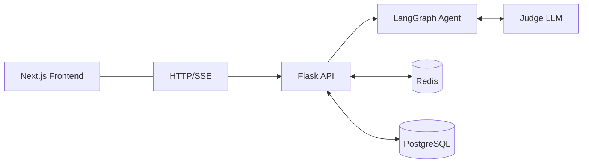
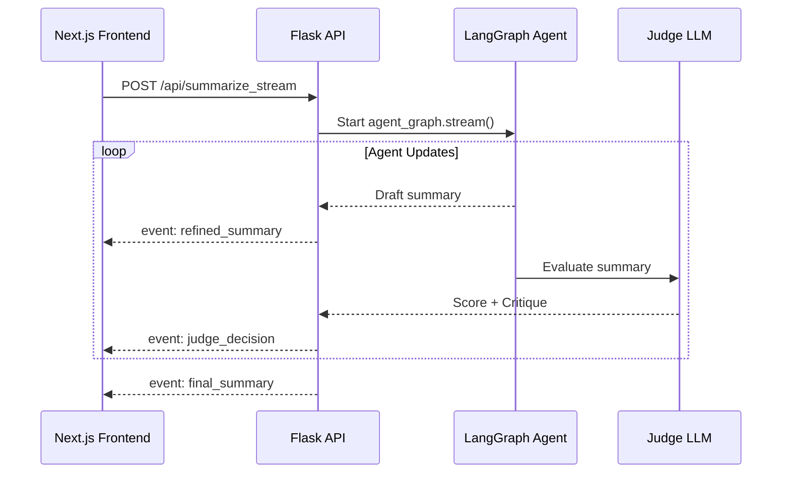
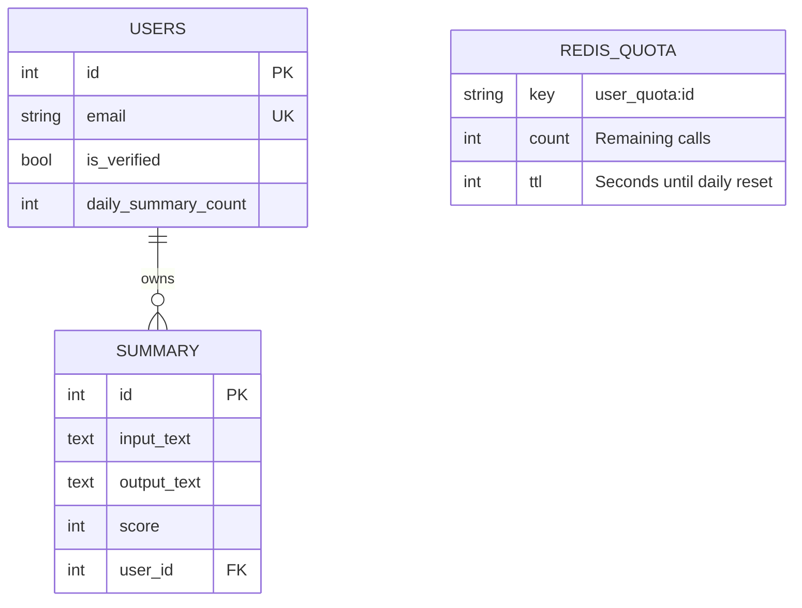

# Summarization Workflow Backend

An agentic summarization engine built with Flask and LangGraph. This service doesn’t just summarize; it uses an iterative LLM-as-a-Judge loop to refine outputs, ensuring high-quality results before they are persisted or streamed to the user.


Designed for users requiring reliable summaries of long-form text with full transparency into the production process.

---

## System Architecture

The backend operates as a coordinated pipeline between volatile state (Redis), persistent history (PostgreSQL), and the agentic layer (LangGraph).

Understanding how a request moves through the system is key to its performance and security:


### Streaming Summarization Workflow
To minimize perceived latency, the system uses **NDJSON** to stream incremental drafts and judge critiques to the frontend in real-time.



### Key Features
- **Agentic Self-Correction:** Multi-step refinement process via LangGraph that iterates until the "Judge" confirms quality standards.
- **Secure Auth:** JWT-based authentication using HttpOnly cookies to mitigate XSS risks.
- **Atomic Rate Limiting:** Redis-backed daily quotas per user to manage costs and prevent API abuse.
- **Fuzzy Caching:** Hybrid caching (Redis + Postgres) provides instant responses for identical or highly similar document inputs.
- **Real-time Feedback:** Streaming support via Server-Sent Events (SSE) allows users to observe the "thought process" of the agent.

---

## Database Schema (ERD)

Note: REDIS_QUOTA represents the key-value schema within Redis, not a relational table.

---

## Project Structure

```text
src/
├── core/
│   ├── routes.py        # API routes (Blueprint)
│   ├── agent_graph.py   # LangGraph workflow
│   └── models.py        # Pydantic schemas
│   └── redis_client.py  # Redis client initialization
├── extensions.py        # DB initialization
└── api.py               # Flask application entry point
```

---

## Setup & Local Development

1. Installation
```
git clone [https://github.com/rabebe/ai-chatbot.git]
cd self-correcting-summarizer
python -m venv venv
source venv/bin/activate
pip install -r requirements.txt
```

2. Configuration
Create a `.env` file in the root directory with the following content:

| Variable          | Purpose                       |
| --------------    | ----------------------------- |
| `SECRET_KEY`      | Flask session security        |
| `DATABASE_URL`    | PostgreSQL connection string  |
| `GOOGLE_API_KEY`  | Gemini API key for LLM access |
| `REDIS_URL`       | Redis connection string       |
| `EMAIL_HOST/PORT` | SMTP server host              |
| `EMAIL_USER/PASS` | SMTP username                 |

3. Execution
```
flask db upgrade
flask run --port 5002
```

4. CLI Testing Utility
Observe the agentic loop directly in your terminal without the frontend:
```bash
python run_agent.py data/test_document.txt --max_steps 3
```

---

## Testing Suite
The project includes a `pytest` suite covering the core logic:
- Summarizer Graph: Testing the refinement logic of the AI.
- Quota Enforcement: Validating Redis atomic decrements and TTL resets.
- Fuzzy Caching: Verifying input hashing and cache retrieval.

```bash
pytest tests/
```

---

## Design Decisions & Trade-offs
- **NDJSON over WebSockets:** Chosen to simplify infrastructure and maintain compatibility with standard HTTP load balancers while still allowing real-time updates.
- **Fuzzy Caching:** Uses a combination of Redis (speed) and Postgres (persistence) to identify similar inputs, significantly reducing LLM costs for repetitive requests.
- **LLM-as-a-Judge:** Adds a layer of quality insurance via Pydantic structured output, trading a small increase in token usage for vastly more reliable summaries.
- **Security:** Uses HttpOnly JWT cookies instead of localStorage to provide a stronger defense against XSS attacks.

---

## API Endpoints
| Category | Endpoint | Action |
| --- | --- | --- |
| Auth | `POST /api/register` | Set HttpOnly JWT Cookie |
| Quota | `POST /api/me/quota` | Check remaining daily calls |
| AI | `POST /api/summarize` | Generate AI Summary |
| AI | `POST /api/summarize_stream` | SSE Streaming Summary |

---

## License
This project is licensed under the MIT License - see the [LICENSE](LICENSE) file for details
